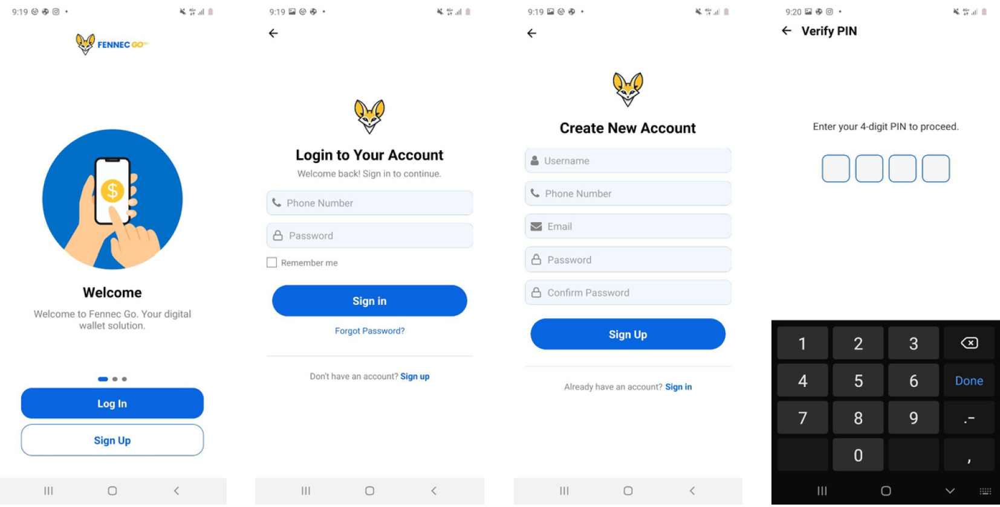
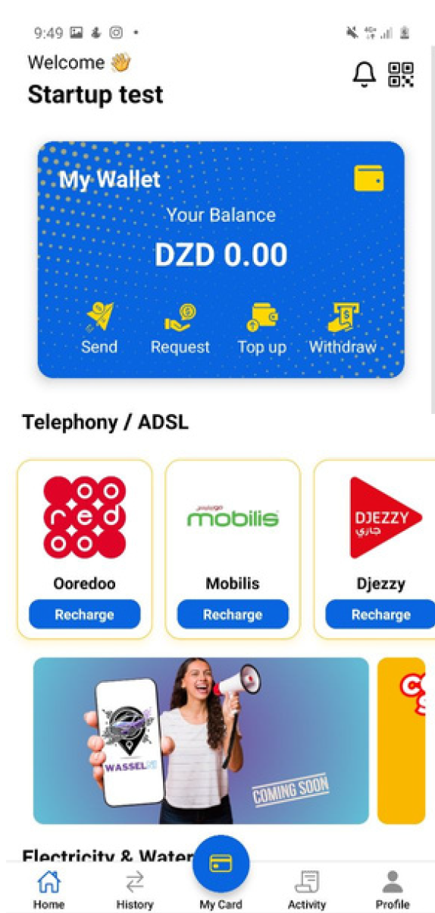
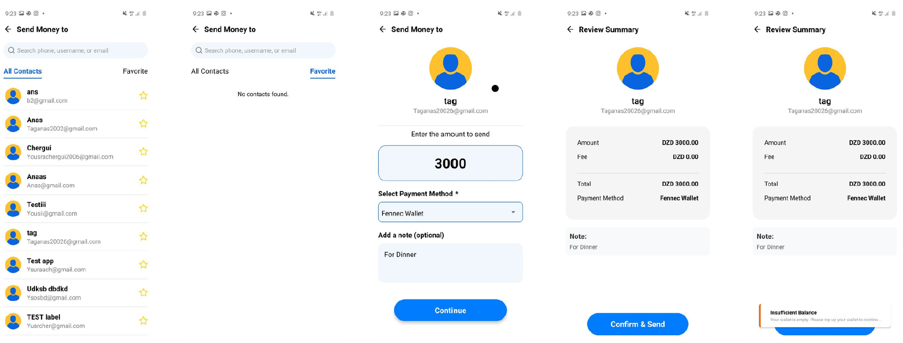
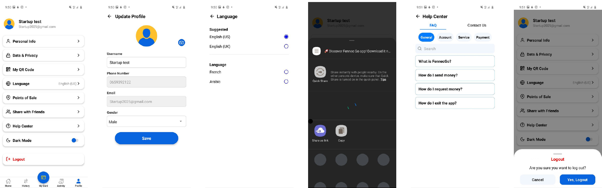

# FennecGo — FinTech Wallet Platform (B2C + B2B)

FennecGo is a **FinTech wallet platform** designed for cash-heavy markets (starting with **Algeria**) to enable people to **pay bills and purchase digital services** through a network of **partner stores and field agents**.

The platform includes **two mobile apps**:
- **Customer App (B2C):** for users to manage their wallet, generate QR codes, transfer money, and track history.
- **Agent / Store Owner App (B2B):** for merchants/agents to scan customer QR codes, process cash-in transactions, and earn commission.

> ⚠️ Portfolio note: This is a **prototype/demo** system. Real payment processing requires legal/compliance work (KYC/AML) and formal agreements with providers (telecom, utilities, etc.).

---

## Why FennecGo

In Algeria, many users rely heavily on **cash** and may not have easy access to card-based digital payments. FennecGo bridges cash to digital services by:
- letting customers complete payments using **cash** through stores/agents
- offering a structured **commission-based agent network**
- creating **job opportunities** for new agents (field agents earn commissions per transaction)

---

## Platform Model (B2C + B2B)

### Customer App (B2C)
For users who want to:
- access a wallet experience
- **generate a QR code** to receive a top-up (cash-in) from an agent
- **send money P2P** to other users (wallet-to-wallet)
- manage **favorites/friends** for quick repeat transfers
- view **transaction history**

### Agent / Store Owner App (B2B)
For stores/agents who:
- collect cash from customers
- scan customer QR codes to identify the wallet/account
- enter the transaction amount and confirm the operation
- earn **commissions** per transaction

---

## Core Features (Implemented)

### ✅ Customer App
- **Authentication** (Email or Phone + Password) using **JWT**
- **Wallet**: view balance
- **QR Cash-in flow**
  - customer generates QR code
  - agent scans and processes the top-up
- **P2P Transfers**
  - send money using another user’s **Account ID**
  - **Favorites/Friends list** for quick repeated transfers
- **Transaction History**
  - track top-ups, transfers, and wallet activity

### ✅ Agent / Store Owner App
- Separate app for agents/store owners
- Uses a **separate Merchant/Agent API**
- **Scan customer QR** → identify customer account
- Agent enters amount → confirms transaction
- Supports **commission-based workflow**

---

## How QR Top-Up Works (Cash-In)

1. Customer generates a **QR code** in the Customer App  
2. Agent scans the QR code in the Agent App  
3. Agent enters the **amount** (cash received) and confirms  
4. Backend validates and records the transaction  
5. Customer wallet updates and history is updated  

---

## Fees & Commission Model (Business Logic)

- **Agents receive commission** from transactions they process
- Platform can take margin/commission from **third-party service providers**
  - Example: provider cost = 90, customer price = 100, platform margin = 10
- **No fees on P2P transfers** (current plan)

---

## Roadmap (Not Implemented Yet)

- ⏳ **Store list**
- ⏳ **Store locator map**
- ⏳ Real integrations with:
  - telecom airtime/data providers
  - utility bills (electricity/water)
  - digital services (gaming vouchers, etc.)
- ⏳ Admin/merchant dashboard
- ⏳ Stronger production readiness (KYC/AML flows, monitoring, audit logs, etc.)

---

## Tech Stack

### Mobile
- **React Native (Expo)**
- **expo-router** for navigation
- **Redux** for state management
- **Axios** for REST API calls

### Backend
- **Java + Spring Boot**
- REST APIs (Customer API + Merchant/Agent API)
- Authentication with **JWT**
- **MySQL** database

### Deployment
- **Docker**
- **AWS EC2**
- MySQL hosted on the **same EC2 instance** (prototype setup)

---

## Architecture

Customer App (Expo RN)  
→ Axios REST calls  
→ Spring Boot API (Docker on AWS EC2)  
→ MySQL (same EC2)

Agent App (Expo RN)  
→ Axios REST calls  
→ Merchant/Agent API (Spring Boot)  
→ MySQL

---

## Repositories

- **Frontend (Expo / React Native):** https://github.com/Taganas2002/fennecgo_frontend  
- **Backend (Spring Boot):** https://github.com/Taganas2002/fennecgo-backend  

---

## Demo (APK)

- **FennecGo — Customer App APK:** (Google Drive link)
- **FennecGo — Agent App APK:** (Google Drive link)

---

## Screenshots

### Login / Register / PIN

### Wallet Home

### Top Up (QR)

### Send Money (P2P)

### Request Money

### Profile / Settings

---

## Contact

- **LinkedIn:** www.linkedin.com/in/tag-anas  
- **Email:** taganas2002@gmail.com
